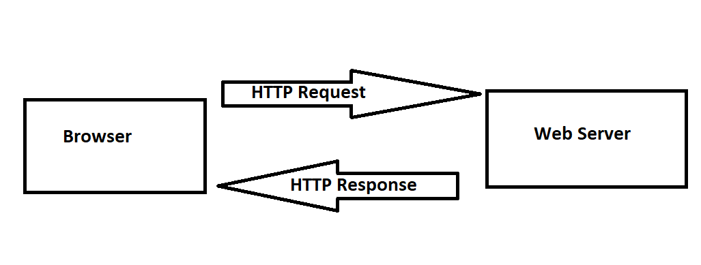

# Movies-Library - 1.0

**Author Name**: Ahmad Ijmail

## WRRC

## Overview

## Getting Started

Run the following command "npm init -y"
Create files structure (server.js, .gitignore, .eslintrc.json )
Install Package:npm install express
Create a route with a method of get and a path of /. The callback should be useing JSON data.
Create a constructor function to ensure your data follow the same format.
Create a function to handle the server error (status 500)
Create a function to handle "page not found error" (status 404)

## Project Features
Not that Features at this time, Handeling req, res