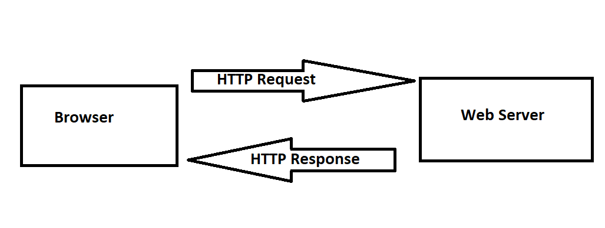
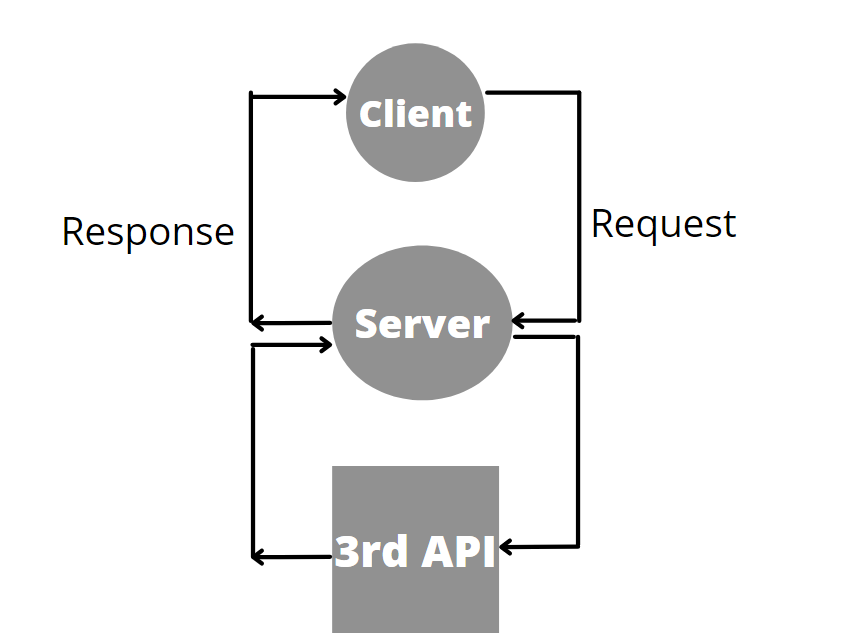
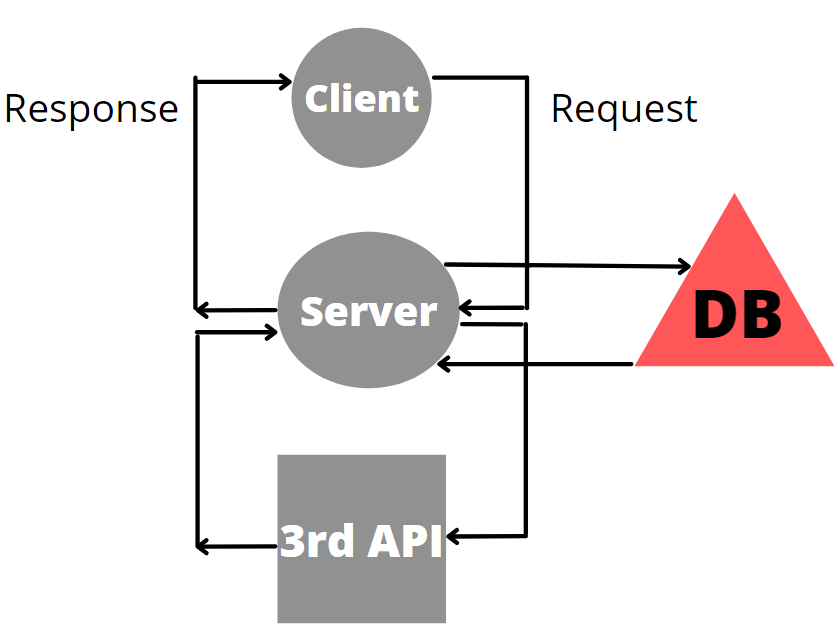

# Movies-Library - 1.0

**Author Name**: Ahmad Ijmail

## WRRC

## Overview

## Getting Started

1- Run the following command "npm init -y"
Create files structure (server.js, .gitignore, .eslintrc.json )

2- Install Package:npm install express 

3- Create a route with a method of get and a path of /. The callback should be useing JSON data.

4- Create a constructor function to ensure your data follow the same format.

5- Create a function to handle the server error (status 500)

6- Create a function to handle "page not found error" (status 404)

7- handling the 3rd party API calls

8- Create a Data Base using " PostgreSQL " 

9- Put data into the databse

10 - Get data from database

## Project Features
Not that Features at this time, Handeling req, res